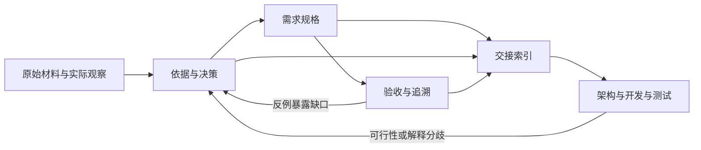

# 设计依据与边界

## 问题到底在哪里

[COMMON] 一份原始需求可能同时包含业务目标、用户抱怨、解决方案猜想、已有系统限制和未经确认的规则。把它们直接扩写成完整文档，会把信息缺口伪装成需求确定性。

[INFERRED] 本体系需要完成五种不同工作：理解原意，发现缺口，建模业务，促成必要决策，形成可验证基线。写作只是把这些工作的结果表达出来。

| 输入问题 | 应进行的工作 | 文档必须留下什么 |
|---|---|---|
| 表达不清 | 解释候选含义，找出会改变结果的差异 | 原文、采用解释、解释依据 |
| 逻辑冲突 | 用具体场景证明冲突，列出选择 | 冲突、影响、决定及授权来源 |
| 信息缺失 | 推导所需信息，提出建议或询问 | 已知、建议、未知及受影响范围 |
| 只有功能愿望 | 追问谁在何种情况下要得到什么结果 | 用户任务、范围、成功判定 |
| 只有页面或原型 | 恢复页面背后的任务、规则与状态 | 交互之外的业务行为 |
| 已有系统要变更 | 对比现状与目标，识别兼容和迁移影响 | 差异、保留规则、受影响依赖 |

## 需求层的边界

[INFERRED] 判断一个细节是否属于本包：如果不同选择会改变业务结果、用户权利、外部承诺、可验收质量或已知限制，它应在需求层有结论或显式未决项；如果它只影响如何达到同一结果，可以交给后续设计。

| 需求专家应交付 | 后续设计应决定 | 边界例外 |
|---|---|---|
| 用户、角色、任务与业务价值 | 模块、服务、部署拓扑 | 客户明确要求某部署方式时，它是有来源的约束 |
| 业务对象、字段语义、关系与生命周期 | 数据表、索引、缓存、序列化实现 | 已有外部协议明确字段时，保留协议要求与版本 |
| 可观察流程、异常结果、权限边界 | 内部调用链、线程和重试实现 | “不得重复扣费”是业务不变量，应写进需求 |
| 质量目标与测量口径 | 如何达到目标、监测技术 | 没有依据的“高可用”“响应很快”仍是未决项 |
| 验收条件与代表场景 | 测试用例全集、自动化代码、执行环境搭建 | 特定验收环境是合同条件时要记录来源 |
| 智能体可行动范围、失败处置、评价依据 | 模型、编排框架、提示词内部结构 | 用户明确指定技术时先辨别硬约束或偏好 |

[COMMON] 需求就绪不代表技术可行性已经验证。遇到可行性不明的问题，应形成验证任务：要回答的业务问题、允许的试验、判定依据、结果影响。不要在需求稿中预先宣布验证成功。

## 通用性建立在语义上

[INFERRED] 以下要素是审查视角，不要求每个项目拥有同名章节。无状态的查询不需要虚构业务状态机；没有外部动作的文本助手不需要虚构审批系统。

| 要素 | 必须能回答的问题 |
|---|---|
| 目的 | 为谁解决什么问题？目标结果是什么？什么结果说明没有解决？ |
| 范围 | 本次包括什么、不包括什么、依赖什么？后续提案与本次承诺如何区分？ |
| 参与者 | 谁发起、操作、受影响、决定、验收？未必是不同的人。 |
| 对象 | 对什么东西做什么？它的身份、字段含义、有效值、关系、归属是什么？ |
| 行为 | 在什么条件下，谁可做什么，得到什么可观察结果？ |
| 规则 | 条件分支、优先级、不变量、例外、时间语义是什么？ |
| 边界 | 失败、重复、并发、取消、过期、权限变化等哪些情况真实可达？ |
| 质量与限制 | 在什么负载、环境、人群或样本下，以什么口径判定达到什么标准？ |
| 依据与决定 | 为什么这样写？谁提供、谁决定？还缺什么？ |
| 验证 | 如何观察结果、获得证据并判定通过或失败？ |

## 对“确定”的处理

[INFERRED] 每一项有争议或影响承诺的信息，分别记录两个维度。它们可以集中在依据表，通过编号引用，不必把每句正文写成长标签。

| 维度 | 可用值 | 含义 |
|---|---|---|
| 依据类型 | 原始陈述、观察证据、推导、建议、未知 | 说明信息从哪里来；原始陈述可能错误或过时 |
| 决策状态 | 待决定、已采纳、已否决、已取代 | 说明能否作为当前范围的承诺；已采纳不等于经过运行验证 |

[INFERRED] “已采纳”必须能定位明确决定、已授权规则，或授权范围内的 agent 决策。推导的前提、适用范围及可能反例应可追踪。估计的信心再高，也不能代替业务授权。

[INFERRED] 本包正文中的 `[COMMON]` 表示一般方法知识，`[INFERRED]` 表示本次设计判断，`[KNOWN]` 表示当前材料或工具已经给出的事实，`[COMPUTED]` 表示计算或检查所得结果。这些是本次表达标记；实际项目的需求效力由依据表和决策状态决定，不要求团队沿用本次标签。

## 粒度和完整性

[INFERRED] 一条需求应表达一个可独立判断的业务责任。共用规则只定义一次，相关行为引用；不要把同一规则复制到每个页面和测试表中。小需求可以直接引用验收场景说明边界，大规则组合可以使用决策表。

[INFERRED] 对每个候选细节做“结果分歧检查”：如果不写，两个合理实现是否可能产生不同且不可同时接受的业务结果？如果是，写清或登记待决定；如果都能满足已确定目标，保留设计自由。文档应详细到消除关键业务歧义，而不是详细到提前决定所有实现。

[COMMON] 验收准则、完整测试用例和业务效果评价并不相同。前者描述交付必须成立的条件，测试设计据此选取执行策略，效果评价衡量上线后是否改善目标。目标指标不能替代具体功能验收，功能验收也不能证明业务价值已经实现。

## 四种视图如何配合

[INFERRED] 该图描述本包工作关系。需求规格是业务语义的权威位置；依据表说明来源与决定；验收表提供判定视角；索引声明生效范围。四者共同组成基线，任何单一视图都不能覆盖其他视图的决定。

[INFERRED] 与后续工程的衔接是：需求发现 → 需求规格 → 规格评审 → 实施计划 → 执行 → 验证 → 验收。本包重点覆盖前三步，并交付后续需要的判定依据。后续发现新约束时回到需求决策，不在实现中悄悄改写业务承诺。

[RULES I BROKE]: 无。
