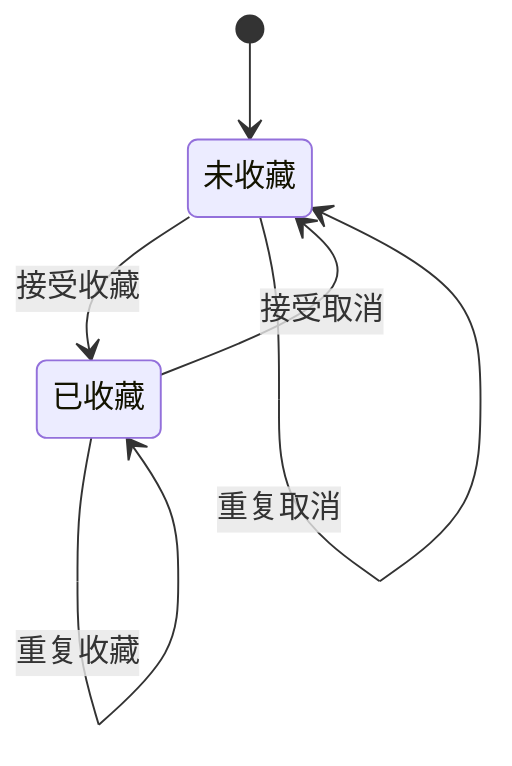

# 示例：补全收藏功能的原始需求

[KNOWN] 本文是本轮编写的合成案例。来源、产品、用户回答与决定均为教学设定，没有来自真实客户的确认。例中的“已采纳”只在模拟情境内成立，不能移植为其他产品的默认要求。

## 输入与缺口

> 用户可以收藏文章，在“我的收藏”查看，按收藏时间倒序，支持取消收藏。已下架文章不可访问。

[INFERRED] 原文已经表达四个能力与一条访问限制，但不能直接推导出以下答案：未登录能否收藏，同一文章能否重复收藏，重复操作是否刷新时间，下架文章在列表里消失还是显示不可用，恢复上架后原收藏是否保留。

| 原文位置 | 可能解释 | 为什么影响交付 | 最小决定 |
|---|---|---|---|
| 用户可以收藏 | 访客可收藏／必须登录 | 身份与数据归属不同 | 本期服务谁，收藏归属谁 |
| 按收藏时间倒序 | 首次收藏／最后点击／重新收藏时间 | 列表结果不同 | 排序时间如何产生及更新 |
| 已下架不可访问 | 列表删除／保留占位 | 用户能否知道原收藏存在 | 不可用记录的展示与恢复 |

## 模拟回答与决定

[KNOWN] 为演示如何形成闭环，以下模拟产品负责人作出了明确回答：本期只服务已登录用户；同一用户同一文章只保留一份有效收藏；重复收藏不改变时间；取消后重新收藏算新收藏；下架时保留不可用占位，恢复上架后可继续访问。

[INFERRED] 以下其余补充均作为方案提出，并在模拟中由同一负责人采纳：同一时间的排序以文章标识固定排序；下架时禁止新收藏，但既有收藏可取消；列表不返回下架文章的标题、摘要或正文；若请求结果不确定，先核实原操作已结束且不会继续改变结果，再读取当前关系恢复操作。最后一项用于说明恢复语义，不指定网络实现。

## 交接视图

[KNOWN] 模拟基线：收藏需求 1.0；决策责任：模拟产品负责人；验收责任：模拟产品负责人和测试负责人。需求侧状态：以下收藏切片就绪。真实技术实现、接口与运行验收均未执行。

| 切片 | 范围 | 依赖 |
|---|---|---|
| 收藏与取消 | 已登录用户对本人收藏进行操作 | 已有身份体系；有效用户身份由该体系提供 |
| 查看收藏 | 读取本人收藏及其可访问状态 | 已有文章体系提供稳定文章标识及当前上架状态，并负责在内容访问时拒绝访问已下架文章 |

[KNOWN] 模拟依赖契约已由产品负责人和文章体系负责人采纳：收藏切片负责关系与列表展示；文章体系负责内容访问检查，即使用户保留旧入口也要按访问时状态拒绝下架内容。该约定尚未通过运行验证，交接时由文章体系负责人按 AC-10 提供依赖验证结果；结果不成立则将依赖该保证的切片标为需复核。

[KNOWN] 模拟范围不含访客收藏、多设备离线修改、收藏夹分类、其他用户收藏的展示、历史收藏迁移和文章永久删除。文章永久删除没有被原文或本次采纳决定纳入；若产品确有该能力，需补充关系处理后再扩展基线。

## 需求视图

### 对象和共用规则

| 对象或字段 | 语义 | 产生与限制 |
|---|---|---|
| 收藏 | 某用户与某文章之间当前有效的收藏关系 | 唯一性范围是用户与文章的组合；取消后当前关系不存在 |
| 收藏.用户 | 收藏所属身份 | 来自已验证身份；用户只能读取和改变自己的收藏 |
| 收藏.文章 | 已有文章的稳定标识 | 来自文章体系；上架与否不改变已有收藏归属 |
| 收藏.时间 | 本次有效收藏首次被系统接受的时刻 | 由系统确定；重复收藏不改写，重新收藏产生新时间；仅用于本示例排序，展示格式留给交互设计 |
| 文章可用性 | 当前是否允许访问文章内容 | 在收藏操作、列表读取和内容访问时按当前文章状态判断 |

[KNOWN] 模拟共用规则：对同一用户、同一文章的操作结果表现为顺序生效；冲突时以系统实际接受的顺序裁决，后生效操作决定最终关系。不得凭客户端按钮状态覆盖更新的业务结果。具体同步机制留给设计。

### REQ-01 添加收藏

[KNOWN] 依据：SRC-01、DEC-01、DEC-02。已采纳。

- 给定已登录用户和当前上架文章，收藏被接受后，本人收藏中存在一条该文章的有效收藏关系。
- 已存在关系时，再次收藏仍返回“已收藏”，保留原收藏时间；不产生第二条关系。
- 身份无效或文章下架时，本次新增不生效，分别反馈需登录或文章不可用。文章此前已被收藏且后来下架时，已有关系保持；用户可从列表取消。
- 操作尚无确定回执时展示结果待核实。只有能确定原修改已经结束且不会继续改变结果，并读到当前关系时，才能退出待核实，显示当前已收藏或未收藏。
- 查询到了当前关系但原修改仍可能生效，不算核实成功。核实失败或仍无法确定时保留待核实并允许再次核实，不宣称成功或失败；核实成功前，该交互入口不接受对该对象的新修改操作。其他入口的合法操作仍按共用顺序规则裁决；不承诺核实后的关系永不被后续操作改变。

### REQ-02 查看本人收藏

[KNOWN] 依据：SRC-01、DEC-01、DEC-02、DEC-03。已采纳。

- 已登录用户可读取自己所有当前有效收藏；身份无效时不返回任何人的收藏并引导登录。
- 按收藏时间倒序；时间相同时按稳定文章标识的固定升序排列。该次序要求适用于结果集，不规定分页或加载实现。
- 上架文章显示当前标题并提供内容入口。下架文章显示“内容暂不可用”占位及取消入口，不提供标题、摘要、正文或内容入口。
- 重新读取时以当时的关系与文章状态展示结果；空列表显示当前没有收藏。读取失败显示读取失败与重试，不把失败当作空列表。
- 本示例不要求其他设备修改后即时更新当前已打开页面；重新读取必须反映已生效结果。

### REQ-03 取消收藏

[KNOWN] 依据：SRC-01、DEC-02。已采纳。

- 已登录用户可以取消自己对上架或下架文章的收藏。成功后当前关系不存在，重新读取列表不再显示该条目。
- 关系已不存在时，取消仍返回“未收藏”，不影响其他用户与其他文章的关系。
- 身份无效时取消不生效并引导登录。结果待核实时采用 REQ-01 的核实规则；核实成功前不接受该对象的新修改操作。
- 重新收藏必须重新满足 REQ-01 条件，产生新的收藏时间。

### 图与状态表

[INFERRED] 图只表达收藏关系变化；文章上架状态是另一个维度，具体守卫与结果由下表及需求正文说明。示例图源尚未经过渲染检查。

| 当前关系 | 条件与动作 | 结果 |
|---|---|---|
| 未收藏 | 已登录、文章上架，接受收藏 | 已收藏，生成时间 |
| 已收藏 | 已登录、文章上架，重复收藏 | 已收藏，保留时间 |
| 任意 | 身份无效，尝试修改 | 关系不变，引导登录 |
| 任意 | 已登录、文章下架，尝试新增收藏 | 不新增，保留原关系，反馈不可用 |
| 任意 | 已登录，接受取消 | 未收藏，不依赖文章是否上架 |
| 已收藏 | 文章下架／重新上架 | 关系与时间不变，只改变读取时的可用性 |

## 依据与决定视图

| 编号 | 内容 | 依据类型 | 模拟决策状态与授权 |
|---|---|---|---|
| SRC-01 | 本文开头的原始输入 | 原始陈述 | 收藏、查看、排序、取消与下架限制已采纳 |
| DEC-01 | 登录范围、本人数据边界、既有身份和文章体系的输入依赖与内容访问责任 | 原始陈述补充与建议 | 模拟产品负责人及相关依赖负责人明确采纳 |
| DEC-02 | 唯一关系、重复、取消后重建、下架修改、核实和冲突顺序 | 建议 | 模拟负责人明确采纳；未采用具体实现 |
| DEC-03 | 排序平局、不可用占位、恢复、读取失败与跨设备刷新边界 | 原始陈述补充与建议 | 模拟负责人明确采纳 |

[KNOWN] 当前模拟范围内无开放业务决定。容量、性能与可访问性等不在这个局部行为示例中给出；不能据此宣称整个收藏产品的全部需求已经就绪。

## 验收与追溯视图

[KNOWN] 以下是模拟中已采纳的验收准则，尚未执行产品测试。验收以本人列表、对象状态、操作反馈和另一用户的对照结果为观察依据，不要求某种数据库或接口。

| 编号 | 给定与动作 | 必须观察到的结果 | 回链 |
|---|---|---|---|
| AC-01 | 用户甲对上架文章首次收藏，再重复收藏 | 仅一条关系，时间不因重复而变，反馈已收藏 | REQ-01；DEC-02 |
| AC-02 | 用户甲取消已有收藏，再重复取消 | 均以未收藏结束；用户乙的收藏不变 | REQ-03；DEC-01、DEC-02 |
| AC-03 | 甲收藏两篇文章，取消较早一篇后重新收藏 | 重新收藏产生新时间，列表按新时间排序；平局按规定顺序 | REQ-01、REQ-02、REQ-03；DEC-02、DEC-03 |
| AC-04 | 一篇已收藏文章下架，之后恢复上架，每次重新读取 | 下架显示不可用且无内容；恢复后显示当前标题和入口；原收藏时间不变 | REQ-02；DEC-03 |
| AC-05 | 未收藏的下架文章被请求收藏；已收藏的下架文章被请求取消 | 前者不新增并反馈不可用；后者取消成功 | REQ-01、REQ-03；DEC-02 |
| AC-06 | 身份无效时请求收藏、查看或取消 | 不返回收藏数据，不修改关系，反馈需要登录 | REQ-01、REQ-02、REQ-03；DEC-01 |
| AC-07 | 修改没有确定回执；查询得到未收藏，但原修改仍可能生效；之后核实到原修改已结束及当前关系 | 第一阶段仍待核实，该入口不接受新修改；只有满足结束条件后显示当前关系并恢复动作。核实失败可再核实 | REQ-01、REQ-03；DEC-02 |
| AC-08 | 甲、乙各有收藏，分别查看；甲列表读取失败 | 各自只看到本人关系；甲失败时显示失败而不是空列表 | REQ-02；DEC-01、DEC-03 |
| AC-09 | 同一关系先接受收藏后接受取消，再重新读取 | 最终未收藏；反向接受顺序则最终已收藏 | REQ-01、REQ-03；DEC-02 |
| AC-10 | 用户保留上架时获得的内容入口，文章下架后才访问 | 文章体系拒绝返回下架内容；文章体系负责人验证此依赖契约，收藏侧核对其结果 | SRC-01 的下架限制；DEC-01；REQ-02 的外部依赖 |

[INFERRED] 本例的关键是把新增规则的来源显露出来，并使每种结果可判断；并非主张任何收藏产品都应该采用以上规则。

[RULES I BROKE]: 无。
